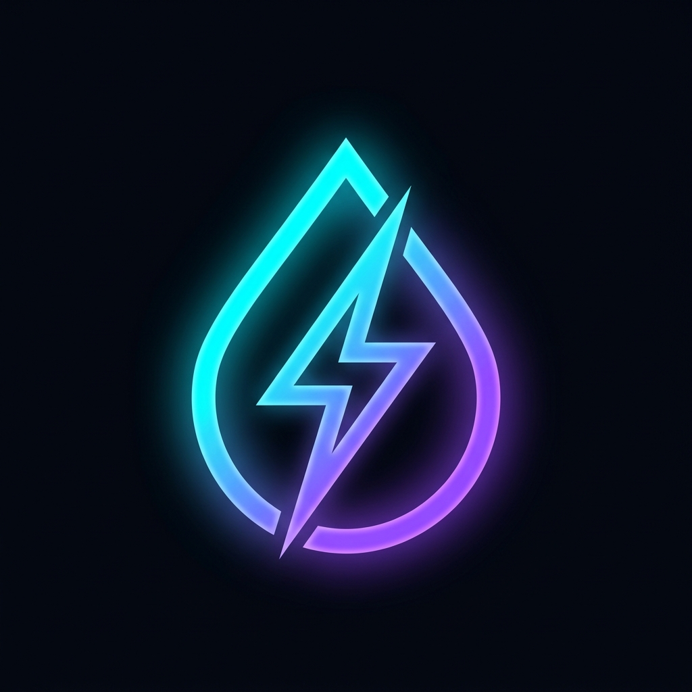

<div align="center">
  
  <h1>BurnerDrop</h1>
  <p><b>Zero-Trust, Privacy-First, Client-Side Encrypted File Sharing</b></p>

  [](https://opensource.org/licenses/MIT)
  [](https://nextjs.org/)
  [](https://www.typescriptlang.org/)
  [](https://tailwindcss.com/)
  [](https://ipfs.tech/)
</div>

<br />

> **BurnerDrop** is a decentralized file drop system. Files are encrypted in the browser before they ever touch the network. **We can route the files, but we can't see them.**

---

## ✨ Features

- **Double Encryption**: Files are given a unique IPFS Content Identifier (CID) and an AES-256-GCM decryption password. Both are required to access the file.
- **Zero-Knowledge Architecture**: Encryption happens entirely client-side using the Web Crypto API. The server never sees the raw file, the encryption key, or the unencrypted metadata.
- **Decentralized Storage**: Encrypted blobs are pinned directly to the IPFS network via Pinata, ensuring high availability and censorship resistance.
- **Lossless Key Management**: Robust base64 implementation ensures keys are perfectly preserved during the URL/Password sharing phase.
- **Beautiful UI/UX**: Custom-designed, premium interface with fluid animations, drag-and-drop support, and built-in dark mode.

---

## 🚀 Quick Start

### Prerequisites
- Node.js 18+
- A [Pinata](https://pinata.cloud/) API JWT

### Installation

1. **Clone the repository**
   ```bash
   git clone https://github.com/hawkeye-exe/burner-drop.git
   cd burner-drop
   ```

2. **Install dependencies**
   ```bash
   npm install
   ```

3. **Configure Environment Variables**
   Create a `.env.local` file in the root directory:
   ```env
   PINATA_JWT="your_pinata_jwt_here"
   ```

4. **Run the Development Server**
   ```bash
   npm run dev
   ```
   Open [http://localhost:3000](http://localhost:3000) in your browser.

---

## 🏗️ System Architecture

BurnerDrop operates on a strict separation of concerns, ensuring that the server infrastructure acts only as a blind relay for encrypted data. 

### Upload Pipeline
1. Files are read directly in the user's browser.
2. Metadata (filename, mime-type) is packed into a unified binary format.
3. The entire payload is encrypted using **AES-256-GCM** via the browser's native Web Crypto API.
4. The resulting ciphertext is sent to our Next.js API route.
5. The API route verifies the payload size and applies rate limiting before forwarding the blind data to the Pinata IPFS network.

### Retrieval Pipeline
1. When a recipient is given the share credentials (CID and Password), the application extracts the details.
2. It fetches the ciphertext from IPFS via gateway fallbacks.
3. Once retrieved, the payload is decrypted client-side.
4. The metadata is unpacked, and the original file is reconstructed and offered for download.

---

## 🛡️ Security & Privacy Engineering

- **Zero-Log Infrastructure**: We do not store files, keys, or metadata on our servers. The infrastructure only processes and relays encrypted binary blobs.
- **Server-Side Secret Masking**: Infrastructure secrets like Pinata JWTs are injected securely on the backend.
- **Edge Security Headers**: We enforce strict HTTPS, HSTS, X-Frame-Options, and no-sniff headers to prevent downgrade attacks and content spoofing.

---

## 🚧 Limitations

- **10MB Upload Limit**: To ensure reliable processing across edge environments, individual file payloads are currently hard-capped at 10MB in the browser and API.
- **IPFS Immutability**: Once an encrypted payload is pinned to IPFS, it cannot be traditionally "deleted." Security relies strictly on the mathematical guarantee of the AES-256-GCM encryption.

---

## 🔮 Future Roadmap

- **Chunked Uploading**: Implementing multi-part uploads to bypass the 10MB restriction for massive files.
- **Smart Contract Expirations**: Integrating decentralized timers (e.g., via Filecoin/smart contracts) to automatically unpin content after a predetermined duration.
- **User Auth & DID Integration**: Exploring Decentralized Identifiers (DIDs) to establish verifiable sender identities without compromising the zero-trust architecture.

---

<div align="center">
  <i>Built with 🔒 for the Hackathon by the Hawkeye Team</i>
</div>
