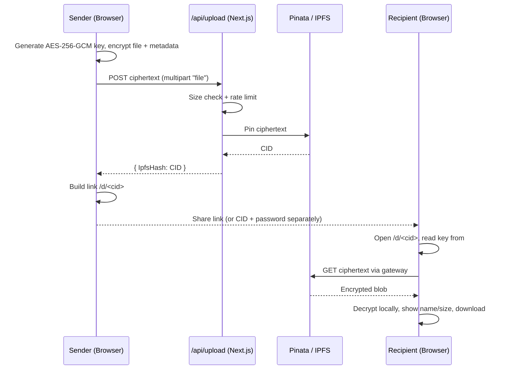

<div align="center">
  
  <h1>BurnerDrop</h1>
  <p><b>Zero-Trust, Privacy-First, Client-Side Encrypted File Sharing</b></p>

  [](https://opensource.org/licenses/MIT)
  [](https://nextjs.org/)
  [](https://www.typescriptlang.org/)
  [](https://tailwindcss.com/)
  [](https://ipfs.tech/)
  [](https://hub.docker.com/)
</div>

<div align="center">
  <h3>One-Click Deploy</h3>

  [](https://vercel.com/new/clone?repository-url=https%3A%2F%2Fgithub.com%2Fhawkeye-exe%2Fburner-drop&env=PINATA_JWT&envDescription=Your%20Pinata%20API%20JWT%20for%20IPFS%20storage&project-name=burnerdrop&repository-name=burner-drop)
  [](https://app.netlify.com/start/deploy?repository=https://github.com/hawkeye-exe/burner-drop)
</div>

<br />

> **BurnerDrop** is a decentralized file drop system. Files are encrypted in the browser before they ever touch the network. **We can route the files, but we can't see them.**

---

## ✨ Features

- **One-Link Sharing**: After encryption you get a single link — `https://<host>/d/<cid>#<key>`. The key lives in the URL fragment (`#...`), which browsers never send to any server, so neither BurnerDrop nor the IPFS gateway ever sees it. The recipient opens the link, sees the file name and size, and decrypts + downloads entirely in their browser.
- **Split Mode**: For extra safety, share the CID and the password over two different channels (e.g. email + Signal). The Receive tab accepts either a full link or a CID + password pair.
- **Double Encryption**: Files are given a unique IPFS Content Identifier (CID) and an AES-256-GCM decryption password. Both are required to access the file.
- **Zero-Knowledge Architecture**: Encryption happens entirely client-side using the Web Crypto API. The server never sees the raw file, the encryption key, or the unencrypted metadata.
- **Decentralized Storage**: Encrypted blobs are pinned directly to the IPFS network via Pinata, ensuring high availability and censorship resistance.
- **Lossless Key Management**: Robust base64 implementation ensures keys are perfectly preserved during the URL/Password sharing phase.
- **Beautiful UI/UX**: Custom-designed, premium interface with fluid animations, drag-and-drop support, and built-in dark mode.

---

## ⚙️ How It Works


```mermaid
sequenceDiagram
    participant S as Sender (Browser)
    participant API as /api/upload (Next.js)
    participant IPFS as Pinata / IPFS
    participant R as Recipient (Browser)

    S->>S: Generate AES-256-GCM key, encrypt file + metadata
    S->>API: POST ciphertext (multipart "file")
    API->>API: Size check + rate limit
    API->>IPFS: Pin ciphertext
    IPFS-->>API: CID
    API-->>S: { IpfsHash: CID }
    S->>S: Build link /d/<cid>#<key>
    S-->>R: Share link (or CID + password separately)
    R->>R: Open /d/<cid>, read key from #fragment (never sent)
    R->>IPFS: GET ciphertext via gateway
    IPFS-->>R: Encrypted blob
    R->>R: Decrypt locally, show name/size, download
```

| Route | Purpose |
|---|---|
| `/` | Send (encrypt + upload) and Receive (paste link or CID + password) |
| `/d/[cid]#<key>` | Recipient page — fetches ciphertext and decrypts in-browser |
| `POST /api/upload` | Blind relay of ciphertext to Pinata (size check + rate limit) |
| `GET /api/health` | `{ ok: true, storage: "pinata" \| "unconfigured" }` — the UI shows a banner when storage isn't configured |

**Live demo:** https://burner-drop.vercel.app

---

## 🚀 Quick Start

### Prerequisites
- Node.js 18+
- A [Pinata](https://pinata.cloud/) API JWT

### Installation

1. **Clone the repository**
   ```bash
   git clone https://github.com/hawkeye-exe/burner-drop.git
   cd burner-drop
   ```

2. **Install dependencies**
   ```bash
   npm install
   ```

3. **Configure Environment Variables**
   Create a `.env.local` file in the root directory:
   ```env
   PINATA_JWT="your_pinata_jwt_here"
   ```

4. **Run the Development Server**
   ```bash
   npm run dev
   ```
   Open [http://localhost:3000](http://localhost:3000) in your browser.

---

## 🏗️ System Architecture

BurnerDrop operates on a strict separation of concerns, ensuring that the server infrastructure acts only as a blind relay for encrypted data. 

### Upload Pipeline
1. Files are read directly in the user's browser.
2. Metadata (filename, mime-type) is packed into a unified binary format.
3. The entire payload is encrypted using **AES-256-GCM** via the browser's native Web Crypto API.
4. The resulting ciphertext is sent to our Next.js API route.
5. The API route verifies the payload size and applies rate limiting before forwarding the blind data to the Pinata IPFS network.

### Retrieval Pipeline
1. The recipient opens the share link `/d/<cid>#<key>`. The key is read from the URL fragment, which is never transmitted over HTTP.
2. The page fetches the ciphertext from the IPFS gateway (with fallback gateways).
3. The payload is decrypted client-side; the original file name and size are shown.
4. The file is reconstructed and offered for download.

In **Split Mode** the recipient pastes the CID and password into the Receive tab instead — same decryption path.

---

## 🛡️ Security & Privacy Engineering

- **Zero-Log Infrastructure**: We do not store files, keys, or metadata on our servers. The infrastructure only processes and relays encrypted binary blobs.
- **Server-Side Secret Masking**: Infrastructure secrets like Pinata JWTs are injected securely on the backend.
- **Key Never Leaves the Browser**: The key is only ever in the URL fragment or the password field. Fragments are not included in HTTP requests, server logs, or (with `Referrer-Policy: no-referrer`) referrer headers.
- **Link = Access**: Anyone holding the full link can decrypt the file. Use Split Mode when the channel itself is untrusted.
- **Edge Security Headers**: We enforce strict HTTPS, HSTS, X-Frame-Options, and no-sniff headers to prevent downgrade attacks and content spoofing.

---

## 🚧 Limitations

- **10MB Upload Limit**: To ensure reliable processing across edge environments, individual file payloads are currently hard-capped at 10MB in the browser and API.
- **IPFS Immutability**: Once an encrypted payload is pinned to IPFS, it cannot be traditionally "deleted." Security relies strictly on the mathematical guarantee of the AES-256-GCM encryption.

---

## 🐳 Self-Hosting

### Docker (Recommended)

```bash
git clone https://github.com/hawkeye-exe/burner-drop.git
cd burner-drop

# Add your Pinata JWT
echo "PINATA_JWT=your_jwt_here" > .env.local

# Build and run
docker compose up -d
```

BurnerDrop will be available at `http://localhost:3000`.

### Manual

```bash
npm install
npm run build
npm start
```

---

## 🧩 Modular SDK — Build Your Own Frontend

BurnerDrop's crypto engine (`src/lib/crypto.ts`) is a **standalone, framework-agnostic module** that runs in any browser environment. You can import it into React, Vue, Svelte, vanilla JS, React Native (with Web Crypto polyfill), or any platform that supports the Web Crypto API.

### Exported Functions

| Function | Description |
|---|---|
| `generateEncryptionKey()` | Generates a random AES-256-GCM key. Returns `CryptoKey`. |
| `exportKey(key)` | Exports a CryptoKey to a base64 string for sharing. |
| `importKey(base64Str)` | Imports a base64 string back into a usable CryptoKey. |
| `encryptFileWithMetadata(file, key)` | Encrypts a `File` object (including its name and MIME type) into a single `Blob`. |
| `decryptFileWithMetadata(blob, key)` | Decrypts a `Blob` back into the original `File` with correct name and type. |

### Usage Example (Vanilla JS)

```js
import { generateEncryptionKey, exportKey, importKey,
         encryptFileWithMetadata, decryptFileWithMetadata } from './crypto';

// Encrypt
const key = await generateEncryptionKey();
const password = await exportKey(key);
const encryptedBlob = await encryptFileWithMetadata(myFile, key);
// Upload encryptedBlob to any storage backend

// Decrypt (on another device)
const key2 = await importKey(password);
const { file } = await decryptFileWithMetadata(encryptedBlob, key2);
// file.name, file.type, and contents are fully restored
```

### API

The backend accepts a `multipart/form-data` request with a single `file` field and forwards it to Pinata IPFS. Returns the Pinata response (including `IpfsHash`) on success.

```bash
curl -X POST -F "file=@encrypted-payload.bin" https://your-domain.com/api/upload
# {"IpfsHash": "Qm...", "PinSize": 1234, "Timestamp": "..."}

curl https://your-domain.com/api/health
# {"ok": true, "storage": "pinata"}
```

Full reference: [docs/07-api.md](docs/07-api.md).

---

## 📚 Documentation

| Doc | Topic |
|---|---|
| [01-architecture.md](docs/01-architecture.md) | System architecture & data flow |
| [02-cryptography.md](docs/02-cryptography.md) | AES-256-GCM payload format & key handling |
| [03-ipfs-storage.md](docs/03-ipfs-storage.md) | Pinata / IPFS storage |
| [04-security-model.md](docs/04-security-model.md) | Security & threat model |
| [05-rate-limiting.md](docs/05-rate-limiting.md) | Rate limiter internals |
| [06-deployment.md](docs/06-deployment.md) | Deployment (Vercel, Docker, Netlify) |
| [07-api.md](docs/07-api.md) | HTTP API reference |

See also [CHANGELOG.md](CHANGELOG.md), [CONTRIBUTING.md](CONTRIBUTING.md), [SECURITY.md](SECURITY.md).

---

<div align="center">
  <i>Built with 🔒 for the Hackathon by the Hawkeye Team</i>
</div>
