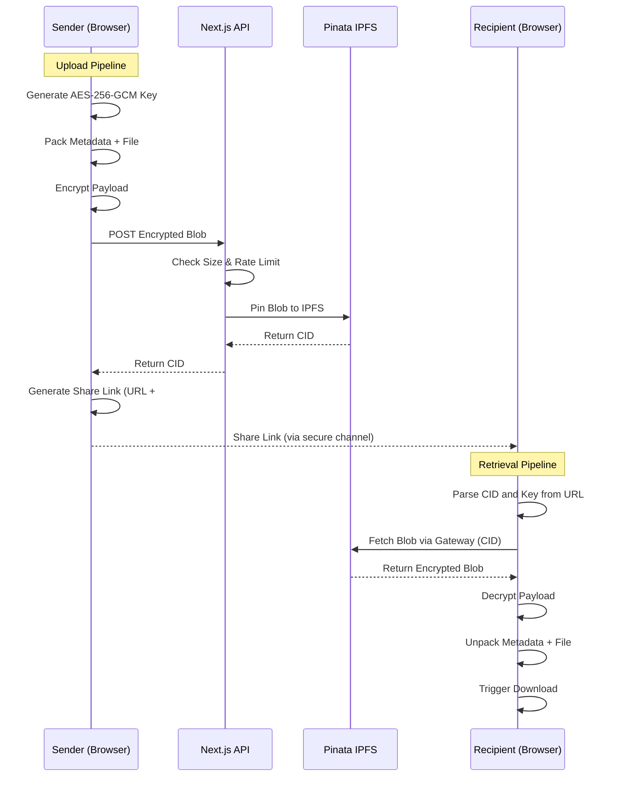

# System Architecture

Burner Drop is designed from the ground up as a true zero-trust file-sharing platform. The fundamental principle is that the server infrastructure must never have access to the unencrypted file contents, the file metadata, or the cryptographic keys required to decrypt them. 

The application architecture is divided into two distinct pipelines: the Upload Pipeline and the Retrieval Pipeline.

## Upload Pipeline

When a user selects a file for sharing, the entire encryption process occurs directly within the browser using the Web Crypto API. The application generates a secure, non-extractable AES-256-GCM key and a random Initialization Vector (IV). The file metadata (name and MIME type) is serialized and prepended to the raw file bytes. This unified payload is then encrypted.

The resulting opaque binary blob is transmitted to the Next.js backend via an API route. The server's only responsibilities are to enforce the 50MB payload size limit, apply the ephemeral IP-based rate limiting, and act as a secure proxy to forward the blob to the Pinata IPFS network using a securely injected JWT. The server then returns the resulting IPFS Content Identifier (CID) to the client.

## Retrieval Pipeline

The sharing link generated for the recipient contains the IPFS CID in the URL path and the exported decryption key in the URL hash fragment (`#`). Because hash fragments are never transmitted to the server in standard HTTP requests, the backend remains entirely blind to the key.

Upon accessing the link, the client-side application extracts the CID and fetches the encrypted blob from IPFS gateways. Once the blob is retrieved, the application uses the key from the hash fragment to decrypt the payload, unpack the metadata, and reconstruct the original file for download.

## Flow Diagram

