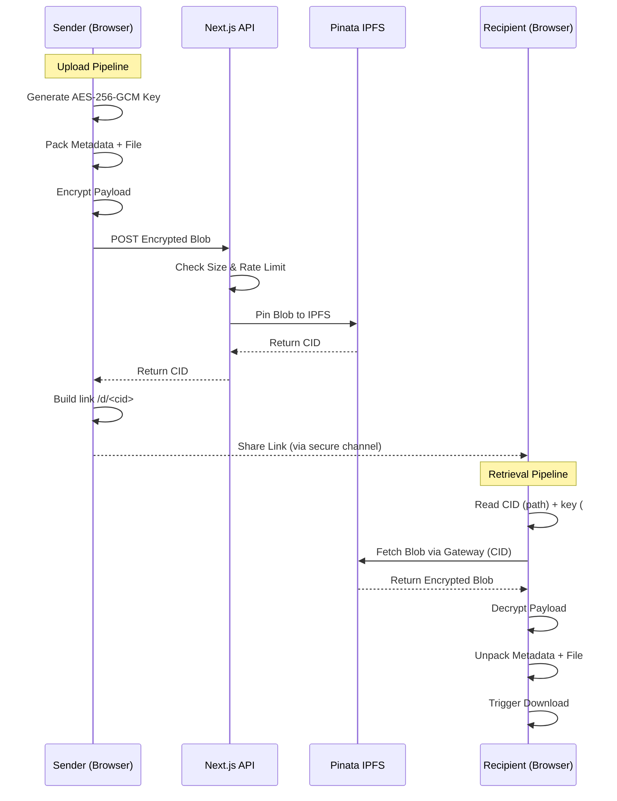

# System Architecture

Burner Drop is designed from the ground up as a true zero-trust file-sharing platform. The fundamental principle is that the server infrastructure must never have access to the unencrypted file contents, the file metadata, or the cryptographic keys required to decrypt them. 

The application architecture is divided into two distinct pipelines: the Upload Pipeline and the Retrieval Pipeline.

## Upload Pipeline

When a user selects a file for sharing, the entire encryption process occurs directly within the browser using the Web Crypto API. The application generates a secure, non-extractable AES-256-GCM key and a random Initialization Vector (IV). The file metadata (name and MIME type) is serialized and prepended to the raw file bytes. This unified payload is then encrypted.

The resulting opaque binary blob is transmitted to the Next.js backend via an API route. The server's only responsibilities are to enforce the 50MB payload size limit, apply the ephemeral IP-based rate limiting, and act as a secure proxy to forward the blob to the Pinata IPFS network using a securely injected JWT. The server then returns the resulting IPFS Content Identifier (CID) to the client.

## Retrieval Pipeline

After upload, the sender is shown a single share link of the form:

```
https://<host>/d/<cid>#<key>
```

- `<cid>` — the IPFS Content Identifier of the ciphertext (URL path).
- `<key>` — the base64url-encoded AES-256 key (URL fragment).

Browsers never transmit the fragment (`#...`) in HTTP requests, so the Next.js server, the CDN, and the IPFS gateway only ever see the CID. The key never appears in request lines, access logs, or (with `Referrer-Policy: no-referrer`) referrer headers.

The `/d/[cid]` page is a client-rendered route. On load it:

1. Reads the CID from the path and the key from `window.location.hash`.
2. Fetches the ciphertext from the configured IPFS gateway (falling back to public gateways).
3. Decrypts the payload in-browser, unpacks the metadata, and shows the file name and size.
4. Offers a **Download** button that saves the reconstructed file locally.

### Split Mode

For higher-risk transfers the sender can share the CID and password over two separate channels. The **Receive** tab on `/` accepts either a full link or a CID + password pair; both paths use the same decryption code.

## Health & Configuration

`GET /api/health` returns `{ ok: true, storage: "pinata" | "unconfigured" }`. The UI calls it on load and shows a banner when no storage backend (`PINATA_JWT`) is configured, so misconfigured deployments fail visibly instead of erroring on upload.

## Routes

| Route | Type | Responsibility |
|---|---|---|
| `/` | Client page | Send (encrypt + upload) / Receive (link or CID + password) |
| `/d/[cid]` | Client page | Recipient view: fetch, decrypt, download |
| `POST /api/upload` | Route handler | Size check, rate limit, blind relay to Pinata |
| `GET /api/health` | Route handler | Storage configuration status |

## Flow Diagram


```mermaid
sequenceDiagram
    participant Sender as Sender (Browser)
    participant Server as Next.js API
    participant IPFS as Pinata IPFS
    participant Recipient as Recipient (Browser)

    Note over Sender: Upload Pipeline
    Sender->>Sender: Generate AES-256-GCM Key
    Sender->>Sender: Pack Metadata + File
    Sender->>Sender: Encrypt Payload
    Sender->>Server: POST Encrypted Blob
    Server->>Server: Check Size & Rate Limit
    Server->>IPFS: Pin Blob to IPFS
    IPFS-->>Server: Return CID
    Server-->>Sender: Return CID
    Sender->>Sender: Build link /d/<cid>#<key>
    Sender-->>Recipient: Share Link (via secure channel)

    Note over Recipient: Retrieval Pipeline
    Recipient->>Recipient: Read CID (path) + key (#fragment, never sent)
    Recipient->>IPFS: Fetch Blob via Gateway (CID)
    IPFS-->>Recipient: Return Encrypted Blob
    Recipient->>Recipient: Decrypt Payload
    Recipient->>Recipient: Unpack Metadata + File
    Recipient->>Recipient: Trigger Download
```
