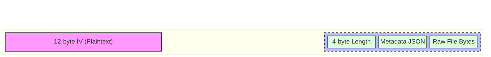

# Cryptography

Burner Drop relies entirely on the browser's native Web Crypto API (`window.crypto.subtle`) to ensure that all encryption and decryption operations occur strictly on the client side.

## Algorithm and Key Management

The application utilizes **AES-256-GCM** (Advanced Encryption Standard with Galois/Counter Mode). This algorithm provides both confidentiality (encryption) and authenticity (integrity verification), ensuring that any tampering with the payload while at rest on IPFS or in transit will result in a decryption failure rather than silently returning corrupted data.

When a user initiates an upload, a new, mathematically random 256-bit (32-byte) key is generated. Crucially, the Web Crypto API is instructed to mark this `CryptoKey` object as `extractable: false` for general use, preventing malicious extensions or cross-site scripting (XSS) attacks from casually scraping the key from memory.

However, to generate the shareable link, the raw key material must be exported. To achieve this securely, our internal crypto utility wraps the generation and export process. The raw key bytes are extracted exactly once, converted to a Base64 string, and temporarily stored in a module-local `WeakMap` associated with the `CryptoKey` reference. This string is appended to the URL hash fragment (`#`) and provided to the user.

## Payload Packing

To ensure that the recipient can reconstruct the original file with its correct name and extension, the file metadata must be encrypted alongside the file contents.

The application serializes the file's `name` and `type` (MIME) into a JSON string. This string is converted into a `Uint8Array`. The length of this metadata array is calculated and encoded as a 4-byte little-endian header.

The final plaintext payload is constructed by concatenating:
1. `[4-byte metadata length header]`
2. `[JSON metadata bytes]`
3. `[Raw file bytes]`

A random 12-byte Initialization Vector (IV) is generated for the AES-GCM operation. The unified payload is encrypted, and the final output blob is constructed by prepending the 12-byte IV to the resulting ciphertext.

## Decryption

Upon retrieval, the process is reversed. The first 12 bytes are sliced off to retrieve the IV. The remaining ciphertext is decrypted using the key extracted from the URL hash. The 4-byte header is read to determine the length of the metadata, the JSON is parsed, and the remaining bytes are fed into a new `File` object using the recovered name and MIME type.

## Payload Structure

