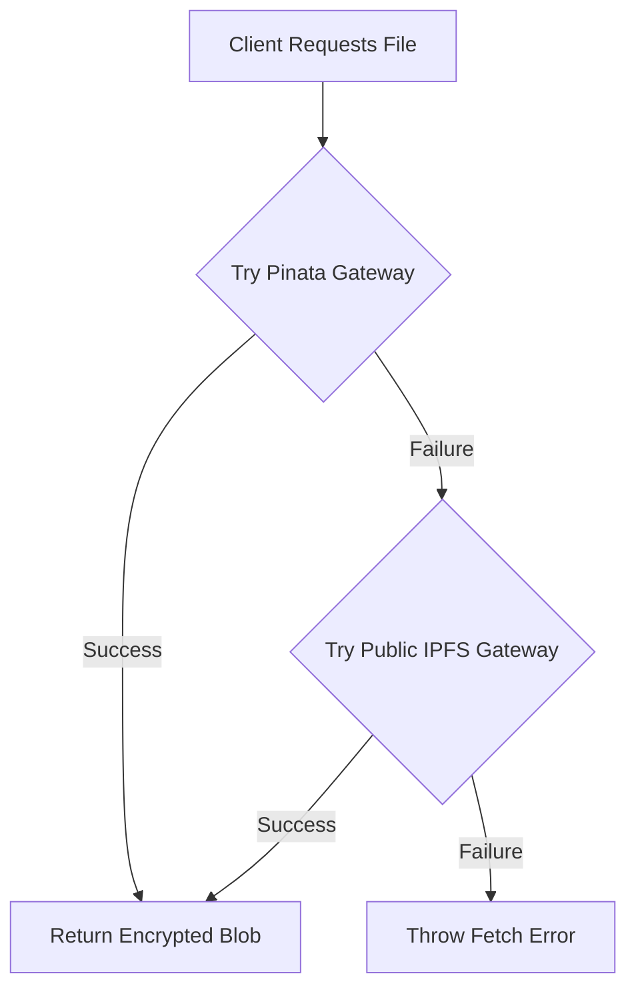

# IPFS Storage & Distribution

To ensure high availability and censorship resistance, Burner Drop utilizes the InterPlanetary File System (IPFS) for storing the encrypted payloads. IPFS is a distributed, peer-to-peer file sharing network that relies on content addressing rather than location addressing.

## Content Addressing

When a file is uploaded to IPFS, it is not placed at a specific URL like `example.com/file.bin`. Instead, the network processes the file's contents through a cryptographic hash function to generate a unique Content Identifier (CID). This CID acts as both the file's address and a built-in integrity check.

Because our payloads are client-side encrypted using AES-256-GCM with a random Initialization Vector (IV) for every single upload, identical plaintext files will always produce entirely different ciphertext blobs. Consequently, they will generate completely unique IPFS CIDs, preventing any form of network-level deduplication analysis.

## Pinning with Pinata

Files on IPFS are ephemeral unless explicitly "pinned" by a node on the network. If no node actively serves the file, it will eventually be garbage collected and lost. 

To guarantee that uploaded files remain available for recipients, Burner Drop's backend API route acts as a proxy to [Pinata](https://pinata.cloud/), an enterprise-grade IPFS pinning service. The server authenticates with Pinata using a secure JWT and uploads the `encrypted-payload.bin` directly to their pinning nodes. Pinata ensures the data is propagated across the IPFS network and kept alive.

## Gateway Fallback Strategy

Retrieving data from IPFS in a standard web browser requires the use of HTTP-to-IPFS gateways. Because gateways can experience latency, rate limiting, or downtime, Burner Drop implements a robust fallback strategy on the client side.

When a recipient attempts to download a file, the application first attempts to fetch the CID via Pinata's dedicated, high-speed gateway (`gateway.pinata.cloud`). If this request fails or times out, the application automatically falls back to the public, community-run gateway (`ipfs.io`). This redundancy ensures a smooth user experience even if the primary gateway is degraded.

## Retrieval Flow

