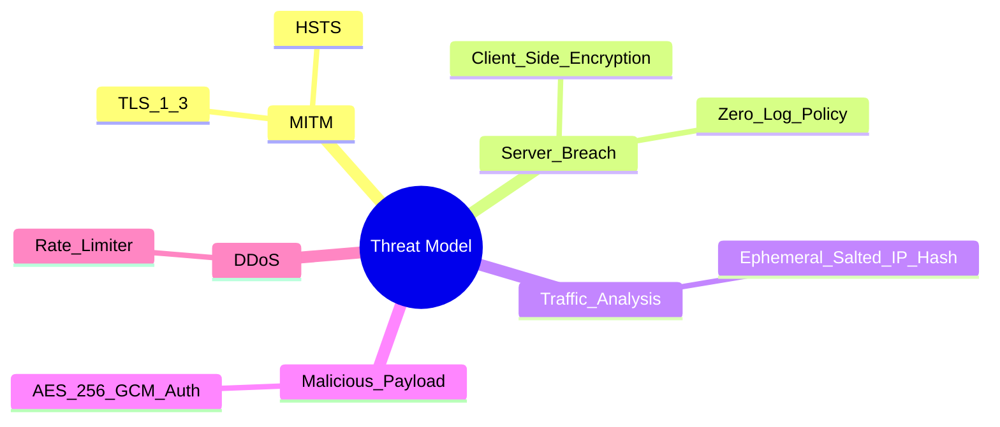

# Security Model

Burner Drop's security model is predicated on the assumption that all server infrastructure and transit networks are fundamentally compromised. By moving the cryptographic boundary to the extreme edge (the user's browser), the platform achieves a zero-trust architecture.

## Zero-Log Architecture

The most critical component of our security posture is what we do not store. The server acts exclusively as a blind proxy, meaning it never possesses:
- The plaintext file contents
- The file metadata (name, MIME type)
- The AES-256-GCM decryption key
- The URLs or share links containing the hash fragments

Because this data is never transmitted to our infrastructure, it cannot be leaked in a database breach, compelled by a subpoena, or intercepted via server-side logging.

## Ephemeral IP Hashing

While rate limiting is necessary to prevent denial-of-service vectors, storing raw IP addresses introduces a privacy risk. To mitigate this, Burner Drop employs an ephemeral salted hashing mechanism. 

Upon server initialization, the Node.js process generates a secure 16-byte random salt (`EPHEMERAL_SALT`). Any incoming IP address is immediately hashed using SHA-256 combined with this salt. Only the resulting hex digest is tracked in the in-memory map. When the server process terminates or restarts, the salt is destroyed. This ensures that historical traffic logs cannot be reverse-engineered via rainbow tables.

## Edge Middleware & Network Security

To protect the client-side execution environment from tampering, the application relies on strict transport security:
- **HTTPS Enforcement**: All traffic is mandated over TLS 1.3, preventing man-in-the-middle (MITM) downgrade attacks.
- **HSTS**: HTTP Strict Transport Security ensures browsers refuse any insecure connections.
- **X-Frame-Options & CSP**: Prevents clickjacking by denying the application from being embedded in malicious iframes.
- **X-Content-Type-Options**: The `nosniff` header forces browsers to respect the declared MIME types, mitigating drive-by download exploits.

## Threat Model

