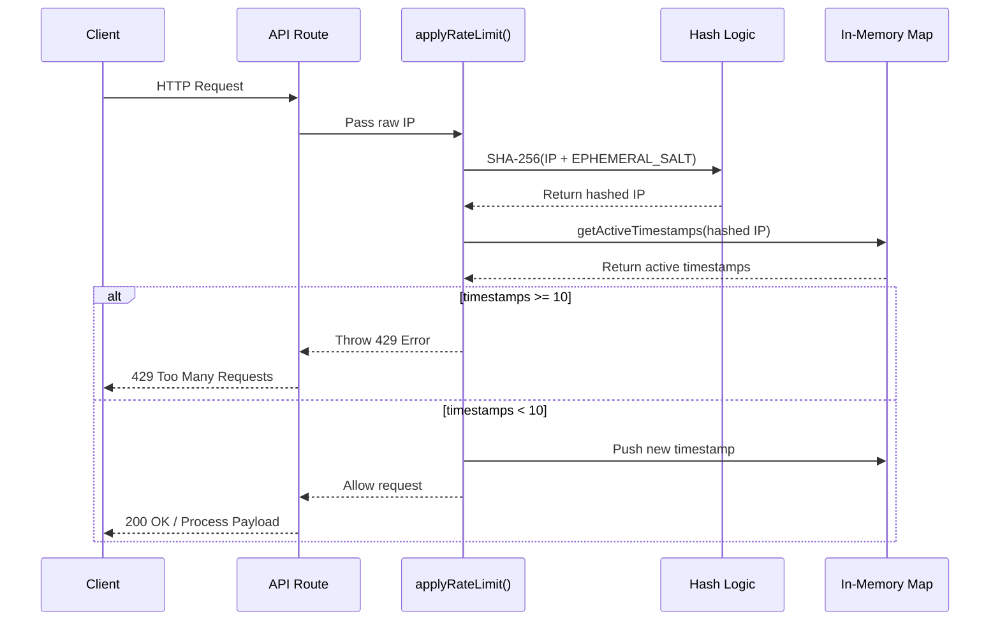

# Rate Limiting Internals

Burner Drop implements a robust, privacy-first rate-limiting mechanism to mitigate abuse and denial-of-service vectors while ensuring zero-trust guarantees. 

## How it works

The application utilizes an in-memory sliding window algorithm to throttle incoming connections. By default, the system restricts traffic to a maximum of 10 requests per 60-second window for any given IP address. When a request is processed, the system dynamically filters out timestamps that fall outside the trailing 60-second threshold. If the remaining active request count meets or exceeds the limit, the system immediately rejects the connection by throwing a `429 Too Many Requests` error. Otherwise, the new request timestamp is appended to the ledger, and the connection is allowed to proceed.

## Privacy guarantee

To rigorously uphold Burner Drop's zero-trust architecture, raw IP addresses are never logged or stored in plain text. Upon server startup, the Node.js application generates a cryptographically secure 16-byte `EPHEMERAL_SALT`. Before any IP address is recorded in the tracking map, it is hashed via SHA-256 combined with this ephemeral salt. The internal memory map only stores the resulting hex digest. Because the salt is entirely ephemeral and securely destroyed upon process termination, it is mathematically impossible to reverse-engineer raw IP addresses or conduct historical traffic analysis from memory dumps or persistent storage.

## Limitations

The current rate-limiting state is strictly node-local. In distributed serverless deployments, such as Vercel Edge Functions or AWS Lambda, each instance maintains its own isolated memory map and unique ephemeral salt. Consequently, a single user whose requests are routed across multiple distinct edge nodes may temporarily exceed the theoretical global limit of 10 requests per minute. This node-local fragmentation is an accepted architectural trade-off, prioritizing ultra-fast execution and absolute privacy over strict global synchronization.

## Flow Diagram

